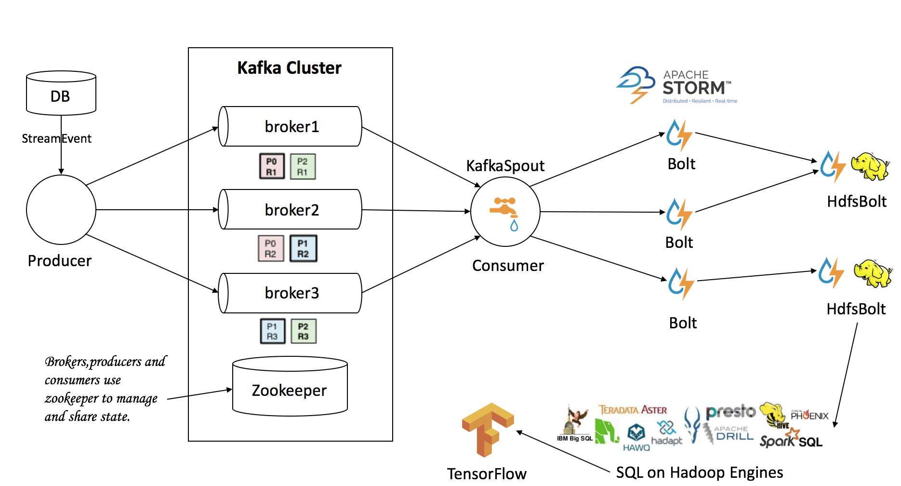

# strom-kafka-examples

Process Design



# Testing
1. Linux Terminal execute command
```
    zookeeper-cli   # create /order /id
```
2. Maven package to target directory
* send msg to kafka
```
    storm jar storm-kafka-examples-1.0-SNAPSHOT.jar cn.itweet.sendmsg.SendMessageKafka
```

* storm processing data
```
    storm jar storm-kafka-examples-1.0-SNAPSHOT.jar cn.itweet.kafka_storm.topology.CounterTopology
```

* Processing data to HDFS,Running results `hadoop fs -ls /tmp/order_hdfs-xxx.log`